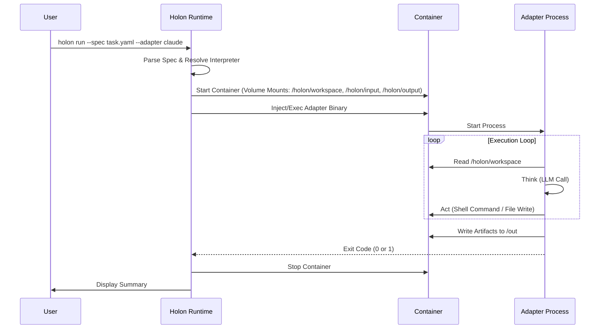

# RFC-0001: Holon v0.1 – Execution Units for Autonomous Engineering

| Metadata | Value |
| :--- | :--- |
| **Status** | **Draft** |
| **Author** | Holon Contributors |
| **Created** | 2025-12-16 |
| **Target Version** | v0.1 |

## 1. Summary

This RFC defines **Holon v0.1**, a minimal execution framework that standardizes how AI-driven software engineering work is executed, packaged, and integrated.

Holon introduces the **Holon** as a standardized "Atomic Execution Unit". It defines:
*   **The Protocol**: How a Holon describes its task (Spec) and reports results (Artifacts).
*   **The Runtime**: How the host orchestrates the execution sandbox.
*   **The Adapter**: How diverse AI agents are wrapped into a uniform execution interface.

Holon v0.1 intentionally avoids orchestration, complex scheduling, or persistent services, focusing solely on the **single unit of execution**.

## 2. Motivation

While AI coding agents (Claude, OpenHands, etc.) are maturing, they suffer from an **"Engineering Gap"**:
*   **Implicit State**: Agent behavior relies on ephemeral chat history.
*   **Unstructured Output**: Results vary between runs (chat text vs. diffs vs. files).
*   **Integration Friction**: CI/CD systems expect processes with explicit inputs, outputs, and exit codes, not "chatbots".

**Holon bridges this gap** by treating an AI Agent session as a **Standardized Batch Job**.

## 3. Goals

*   **Atomic**: Every execution is self-contained. No side effects outside the declared outputs.
*   **Polymorphic**: The same Spec can be executed by different Agents (Adapters) simply by swapping the Adapter URI.
*   **Reproducible**: Input (Workspace + Spec + Adapter) $\rightarrow$ Output (Artifacts) is deterministic (within the limits of LLM non-determinism).
*   **Integratable**: Runs as a standard CLI process or Docker container, compatible with any CI system (GitHub Actions, Jenkins).

## 4. Non-Goals (v0.1)

*   **Agent Implementation**: Holon is not an AI Agent; it is the *container* for Agents.
*   **Orchestration**: No multi-step workflows or DAGs (yet).
*   **SaaS/UI**: Holon is a CLI/Protocol first.

## 5. Core Concepts

### 5.1 Holon (The Unit)
A Holon is a single execution attempt of a defined engineering task. It has a binary outcome state: `Success`, `Failure`, or `NeedsHumanReview`.

### 5.2 Holon Spec (The Input)
A declarative document (YAML/JSON) defining the **Input State** and **Goal**.
*   **Context**: The workspace snapshot, environment variables, and associated metadata (Issue ID, PR comments).
*   **Constraints**: Timeouts, network policies, allowed shell commands.
*   **Output Definition**: Required artifacts (e.g., `git.patch`, `summary.md`).

### 5.3 Adapter (The Engine)
The component that "does the work". An Adapter bridges the Holon Protocol to a specific AI Agent.
*   **Static Adapter**: A dedicated Docker image containing the Agent and toolchain (e.g., `holon/adapter-openhands:latest`).
*   **Dynamic Adapter**: A binary injected into a standard User image (e.g., `node:18` + `injected-holon-binary`) to turn it into a Holon.

### 5.4 Runtime (The Host)
The `holon` CLI acting as the supervisor. It manages:
*   **Sandboxing**: spinning up the container.
*   **Mounting**: providing the Workspace, Spec, and Credentials.
*   **Teardown**: collecting artifacts and cleaning up.

## 6. Spec Schema Definition

The `spec.yaml` defines the task.

```yaml
version: "v1"
kind: Holon

metadata:
  name: "task-name"        # Human-readable slug
  id: "uuid-optional"      # Tracking ID

# INPUT: The context provided to the Agent
context:
  workspace: "/holon/workspace"  # Workspace root inside container (default)
  files:                   # Priority files to focus on
    - "src/main.go"
    - "README.md"
  env:                     # Non-secret environment variables
    TEST_MODE: "true"

# GOAL: What needs to be done
goal:
  description: "Fix the nil pointer exception in Handler"
  issue_id: "GH-123"       # Optional reference

# OUTPUT: Required deliverables
output:
  artifacts:
    - path: "patch.diff"
      required: true
    - path: "summary.md"
      required: true
    - path: "tests.log"
      required: false

# CONSTRAINTS: Execution boundaries
constraints:
  timeout: "10m"
  max_steps: 50            # Agent step limit (if supported)
```

## 7. Architecture Overview



## 8. The Adapter Interface (Protocol)

Adapters MUST adhere to this **File-System Interface** within the container.

### 8.1 Inputs (Read-Only)
*   `/holon/input/spec.yaml`: The task definition.
*   `/holon/input/context/`: Additional injected context files (e.g., issue description).
*   `/holon/secrets/`: (Mounted volume or Env Vars) API Keys.
*   `/holon/workspace/`: The target source code workspace (Read-Write, repo root).

### 8.2 Outputs (Read-Write)
Adapters MUST write results to `/holon/output/`. Adapters MAY also read files they created under `/holon/output/` during the same run (e.g., incremental plans, temporary notes, cached analysis).
*   `manifest.json`: Metadata about the run (status, cost, duration).
*   `diff.patch`: The code changes (if any).
*   `summary.md`: Human-readable report.
*   `evidence/`: Logs, test results, screenshots.

**Host behavior**: The Host SHOULD treat `/holon/output/` as the output boundary for integration purposes, and SHOULD ensure it starts empty for each run (e.g., create a fresh output directory or clear the target directory before execution) to avoid cross-run contamination.

### 8.3 Lifecycle
*   **Single-Shot**: The process starts, performs the task, writes outputs, and terminates.
*   **No Daemon**: It does not listen on ports.

## 9. Network & Security (v0.1 Scope)

### 9.1 Network Policy
For v0.1, Holon assumes **Open Network Access** (Default).
*   **Reasoning**: Agents usually require HTTPS access to LLM APIs (OpenAI, Anthropic). Blocking network (`--network none`) would disable the Agent unless a complex proxy is used.
*   **Future**: v0.2 may introduce an egress proxy to whitelist only LLM domains.

### 9.2 Credentials & Configuration Injection
Agents need secrets (API Keys) and config (Endpopints). These are **Injected**, never hardcoded in the Spec.

*   **Mechanism**: The Holon CLI passes environment variables from the Host to the Container.
*   **CLI Usage**:
    ```bash
    # explicit pass-through
    holon run --env ANTHROPIC_API_KEY=$KEY ...
    
    # or auto-forwarding of known prefixes
    export HOLON_SECRET_ANTHROPIC_KEY=...
    holon run ... 
    # Container receives: ANTHROPIC_KEY=...
    ```
*   **File Mounts**: For complex configs (e.g. `~/.gitconfig` or `config.toml`), the CLI supports volume mounting config files via `--config-mount`.

## 10. Integration Pattern: "Context Injection"

Holon does not query GitHub/Jira directly. Instead, the **Caller** (CI Pipeline or Developer) is responsible for fetching context.

1.  **Fetch**: `gh issue view 123 > context/issue.md`
2.  **Refer**: Spec points to `context/issue.md`.
3.  **Run**: `holon run ...`

This makes Holon **Platform Agnostic**.

## 11. CLI Interface (v0.1)

### 11.1 Running a Static Adapter
Use a pre-baked image as the engine.
```bash
holon run \
  --spec ./task.yaml \
  --adapter-image ghcr.io/holon/adapter-openhands:v1 \
  --out ./results
```

### 11.2 Running a Dynamic Adapter (Injection)
Use a standard image and inject the intelligence.
```bash
holon run \
  --spec ./task.yaml \
  --base-image node:20-alpine \
  --adapter native-claude \
  --out ./results
```

## 12. Roadmap

*   **v0.1**: CLI, Spec Definition, Basic Docker Runtime, 1 Reference Adapter (Claude-based).
*   **v0.2**: Secure Sandbox hardening, "Playground" UI for inspecting artifacts.
*   **v1.0**: Stable Protocol, Plugin system for Verification steps.

## 13. Conclusion

**Holon is the interface between AI Probability and Engineering Determinism.**
By standardizing the input/output boundary, we allow "AI Engineering" to scale safely.
