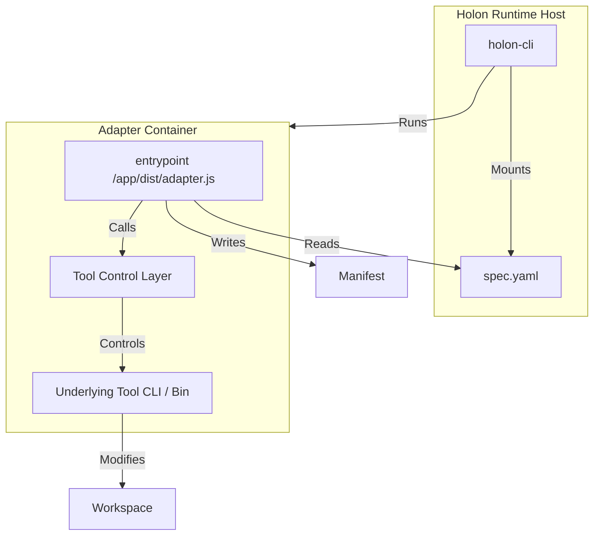

# RFC-0002: Adapter Encapsulation Scheme

| Metadata | Value |
| :--- | :--- |
| **Status** | **Draft** |
| **Author** | Holon Contributors |
| **Created** | 2025-12-18 |
| **Parent** | RFC-0001 |

## 1. Summary

This RFC details the **Adapter Encapsulation Scheme**. The goal is to standardize the integration of *existing* AI coding tools (e.g., `claude` CLI, `gh copilot`) into the Holon ecosystem by wrapping them in self-contained **Adapter Containers**.

For **v0.1**, this RFC focuses on a **Claude Code Adapter** that:
* Uses **Claude Code behavior** (tooling + heuristics) while avoiding interactive UX.
* Is driven via the **Claude Code CLI** to run headlessly.
* Produces **standard Holon artifacts** (`manifest.json`, `diff.patch`, `summary.md`, `evidence/`).

## 2. The Adapter Pattern

An **Adapter** is a Docker container that bridges the **Holon Protocol** (Spec + Context) to the specific runtime requirements of an **Underlying Tool**.

### 2.1 Architecture



### 2.2 Responsibilities

1.  **Holon CLI (Host)**:
    *   Prepare input volumes (`/holon/input`, `/holon/workspace`).
    *   Inject credentials (Env Vars).
    *   Run the Adapter Image.
    *   Collect outputs from `/holon/output`.

2.  **Adapter Bridge (Container Internal)**:
    *   **EntryPoint**: A script (Node/Go/etc.) that runs on container start.
    *   **Translation**: Reads `spec.yaml` and translates it into the tool's native commands (e.g., `claude` prompt, `gh` args).
    *   **Execution**: Manages the tool process.
    *   **Result**: Captures tool output and writes standard Holon Artifacts.

### 2.3 Adapter Contract (v0.1)

To ensure **polymorphism**, every adapter MUST implement the same minimum contract.

**Inputs**
* `/holon/input/spec.yaml` (read-only): Holon Spec.
* `/holon/input/context/` (read-only, optional): injected context files (issue.md, pr.md, etc).
* `/holon/workspace/` (read-write): a *sandbox workspace snapshot* prepared by the Host (see 2.5).
* Secrets via environment variables (e.g., `ANTHROPIC_API_KEY`).

**Outputs** (read-write under `/holon/output/`)
* `manifest.json` (required): status/outcome/duration/artifacts + tool/runtime metadata.
* `diff.patch` (required when Spec requests it): a patch representing the workspace changes.
* `summary.md` (required when Spec requests it): human-readable report.
* `evidence/` (optional): logs and verification output.

Adapters MAY read files they created under `/holon/output/` during the same run (e.g., incremental plans, temporary notes). The Host SHOULD ensure `/holon/output/` starts empty for each run to avoid cross-run contamination.

**Exit Codes**
* `0`: success
* `1`: failure
* `2`: needs human review (when supported; otherwise report via `manifest.json` outcome)

The Host validates `spec.output.artifacts[].required` and fails the run if required outputs are missing.

### 2.4 Execution Environment: Base Image + Adapter Layer

Real engineering tasks require a toolchain (Go/Node/Java/etc). The adapter should not be forced to embed every toolchain.

v0.1 supports composing the final runtime image as:
* **Base Image**: user-selected toolchain image (`golang:1.22`, `node:20`, etc).
* **Adapter Layer**: installs the underlying tool (e.g., `claude-code`) and the bridge (`adapter.js`).

Implementation options (Host-side):
1. **Build-on-Run (recommended)**: generate a small Dockerfile `FROM <base-image>` and install the adapter layer; cache by `(base-image digest, adapter version)`.
2. **Prebuilt Matrix**: maintain `adapter-claude-go`, `adapter-claude-node`, ... (not recommended due to maintenance cost).

### 2.5 Workspace Isolation (Atomicity)

Adapters and underlying tools may modify `/holon/workspace`. To preserve atomic execution:
* The Host MUST mount a **workspace snapshot** into the container (copy/worktree/clone).
* The original user workspace MUST NOT be modified in-place by default.
* Code changes are communicated back via artifacts (especially `diff.patch`), and any application of changes to the original repo is an explicit host-side step (e.g., `--apply`).

## 3. Reference Implementation: Claude Code Adapter

We will reference `thirdparty/wegent` which successfully containerizes `claude-code`.

*   **Underlying Tool**: `@anthropic-ai/claude-code` (Node.js CLI).
*   **Bridge Script**: A TypeScript adapter compiled to `adapter.js` that drives Claude Code **headlessly**, derived from `spec.yaml`.

### 3.1 Why CLI-driven (Non-interactive)

Directly executing `claude` CLI can be interactive (onboarding, permission confirmations, TUI prompts).
For v0.1, the adapter MUST be non-interactive:
* Pre-seed Claude Code configuration files to mark onboarding complete.
* Force an explicit permission mode (e.g., `bypassPermissions`) suitable for sandboxed execution.
* Use `--output-format stream-json` to parse results deterministically.

### 3.2 Container Layout

```
/
  app/
    dist/adapter.js     # The Bridge (compiled)
    package.json        # Node.js dependencies
  root/
    .claude/
      settings.json
    .claude.json
```

### 3.3 Interaction Flow (Headless)

1.  **Start**: Container starts `node /app/dist/adapter.js` (no TTY required).
2.  **Preflight**:
    * Ensure non-interactive Claude Code setup (`~/.claude/*` seeded).
    * Set sandbox-related env (e.g., `IS_SANDBOX=1`).
    * Prepare diff baseline (see 3.4).
3.  **Init**: Prepare CLI flags (cwd, permission mode, model/env overrides when needed).
4.  **Execute**: Translate `spec.yaml` into a prompt and call `claude` with `--print`.
5.  **Wait/Collect**: Stream/capture logs to `evidence/` and wait for completion.
6.  **Artifacts**:
    * Write `/holon/output/diff.patch`
    * Write `/holon/output/summary.md`
    * Write `/holon/output/manifest.json`

### 3.4 Patch Generation Strategy (diff.patch)

The adapter MUST be able to output a patch even when the underlying tool only edits files.

Recommended approach:
* If `/holon/workspace/.git` exists: output `git diff` as `diff.patch`.
* Otherwise: initialize a temporary git repo inside the sandbox workspace snapshot:
  1. `git init`
  2. `git add -A && git commit -m baseline`
  3. After execution: `git diff --patch` to `diff.patch`

This keeps patch generation deterministic and easy to apply by the Host.

### 3.5 Non-interactive Requirements

Adapters MUST avoid prompting for input:
* No onboarding prompts (seed config files and/or set appropriate flags).
* No permission confirmation prompts (force permission mode for sandbox execution).
* No auto-update prompts (disable where possible).
* Always run without TTY and treat missing secrets as a fast failure with a clear `manifest.json`.

## 4. directory Structure

```
images/
  adapter-claude-ts/
    Dockerfile          # Adapter layer (TypeScript bridge + Claude Code dependencies)
    dist/adapter.js     # Bridge implementation (spec -> prompt -> CLI -> artifacts)
    package.json        # Node deps
cmd/
  holon-adapter/        # Deprecated: legacy self-implemented agent (kept for local dev experiments)
```

## 5. Security & Network

*   The container requires network access to call LLM APIs (Anthropic).
*   Credentials (`ANTHROPIC_API_KEY`) are passed as environment variables.
*   Adapters SHOULD redact secrets from logs written under `evidence/`.
*   Adapters SHOULD support reducing non-essential traffic (when the underlying tool supports it).

## 6. Future Work

*   **Dynamic Injection**: For tools without a complex environment, we might inject the bridge binary into a user's image. For complex tools like `claude-code` (requiring Node), the **Static Adapter Image** approach is preferred.
*   **Host Apply Mode**: Add `holon run --apply` to apply `diff.patch` back to the original workspace explicitly.
*   **Contract Tests**: Provide a conformance test suite to validate adapter images against the contract in 2.3.
